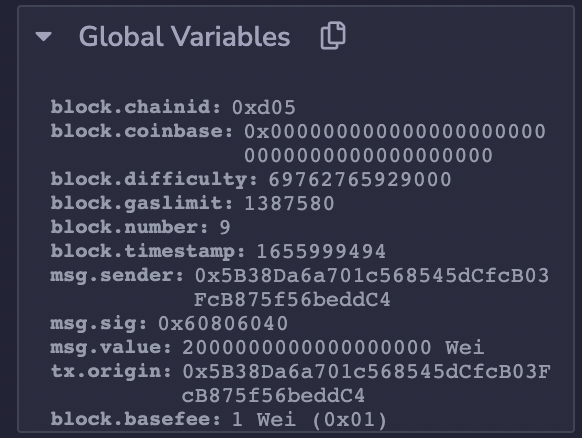
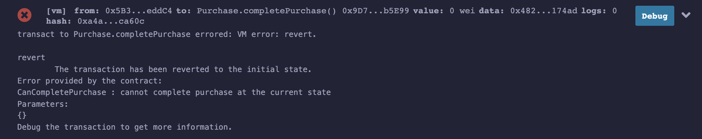
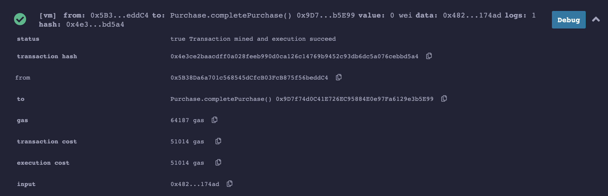
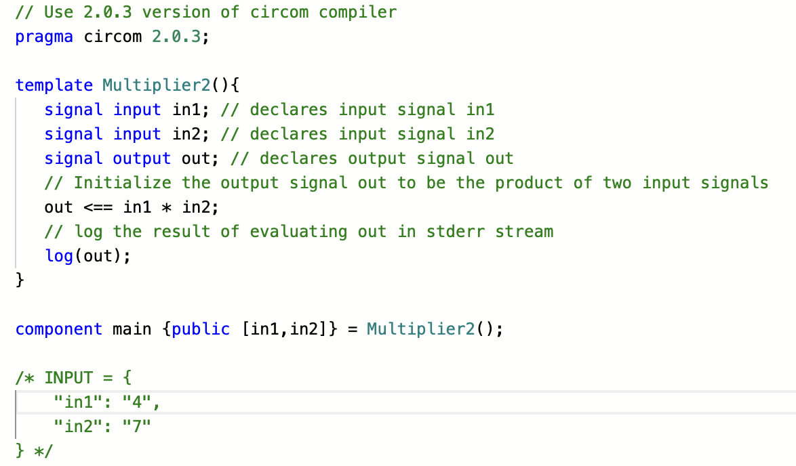

# ZKU Application

This repo contains my solution to the background assignment for Zero Knowledge University.

[escrowing.sol](escrowing.sol) contains the Solidity code for smart contract coding.

Below are the screenshots of the Remix UI that show:

- Time of contract deployment
  - 
- Call by seller reverts before time has elapsed
  - 
- Call by seller succeeds after time has elapsed
  - 

Below is the screenshot of the code for the circuit with in-line annotations.

